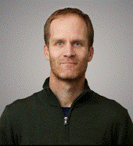

# OM VATTEN
**Om Vatten** (Swedish) translates to **About Water**. This website is about my research and teaching, which revolve around water in various ways.

My research lies at the intersection of environmental engineering and microbial ecology. 
**Environmental engineering** focuses on safeguarding the environment and human health. 
This includes producing safe drinking water; managing wastewater, solid waste, and polluted air; remediating contaminated sites; and fostering a circular economy by recovering resources from waste streams.
**Microbial ecology** examines the interactions between microorganisms and their environments. 
Microbial communities are ubiquitous in nature and perform a vast array of chemical reactions. 
By designing innovative environmental engineering processes, we can harness these naturally occurring microorganisms to our advantage. 
For instance, they can degrade pollutants, produce energy carriers, or ensure the provision of safe drinking water and food.

Check out my <a href="https://scholar.google.com/citations?hl=sv&user=BG6O3hYAAAAJ" target="_blank">scientific publications.</a>

**Oskar Modin**

# <a href="https://omvatten.github.io/textbook">Textbook in Swedish</a>
The textbook Om Vatten is an introduction to water quality and water technology. 
It is written in Swedish and used as course literature in some of my courses.  
<a href="https://omvatten.github.io/textbook">Go to textbook</a>

# Code
Code that I have developed for research and teaching purposes are available on my github page. Here are links:

## <a href="https://github.com/omvatten/qdiv">qdiv</a>
This is a python package for analyzing results from rRNA gene amplicon sequencing or similar data.
See this <a href="https://microbiomejournal.biomedcentral.com/articles/10.1186/s40168-020-00909-7">paper.</a>

## <a href="https://github.com/omvatten/biops">biops</a>
This is a python package for simulating the performance of biological reactors. For example, activated sludge and biofilm reactors used for wastewater treatment.

## <a href="https://github.com/omvatten/pHICsim">pHICsim</a>
This is a streamlit app for calculating pH and inorganic carbon concentration in water and aquaculture systems. 
The website on the streamlit cloud is available <a href="https://omvatten-phicsim-phicsim-66n9yv.streamlitapp.com">here.</a>

## <a href="https://github.com/omvatten/processbanken">processbanken</a>
This is a streamlit app developed for a course for process engineers at wastewater treatment plants (*Processbänken*). It was used for analyzing data submitted by the participants.
The website on the streamlit cloud is available <a href="https://omvatten-processbanken-processbanken-1ew0v8.streamlitapp.com">here.</a>
